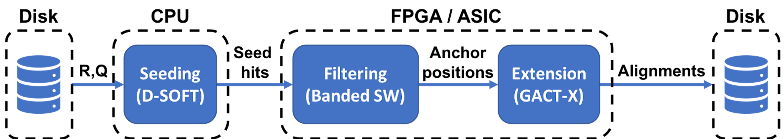

# Darwin-WGA

A co-processor for whole genome alignment.

## Table of Contents

- [Getting Started](#started)
- [Design Overview](#design)
- [Building and Running tests](#test)
    - [Steps for hardware emulation (MODE-hw_emu)](#hw_emu_test)
    - [Steps for running on the EC2 F1 instance, f1.2xlarge (MODE-hw)](#hw_test)
- [Citing Darwin-WGA](#citation)

## <a name="started"></a>Getting Started

The system has been tested on AWS EC2 F1 instance, f1.2xlarge with AMI 1.4.0 (https://amzn.to/2zfsjCM and click on *Continue to Subscribe*).

* Install dependencies

``` 
    $ sudo yum install cmake
    $ sudo yum install zlib-devel zlib-static
```

* Clone aws-fpga directory (https://github.com/aws/aws-fpga)

``` 
    $ git clone https://github.com/aws/aws-fpga.git
    $ export AWS_DIR=$PWD/aws-fpga
    $ source $AWS_DIR/sdaccel_setup.sh
```

* Clone Darwin-WGA repository (https://github.com/gsneha26/Darwin-WGA)

```
    $ git clone https://github.com/gsneha26/Darwin-WGA.git
    $ export PROJECT_DIR=$PWD/Darwin-WGA
```

* Clone tbb package (https://github.com/01org/tbb) 

```
    $ cd $PROJECT_DIR
    $ git clone https://github.com/01org/tbb 
```

* Copy kseq.h from https://github.com/lh3/ksw2

```
    $ cd $PROJECT_DIR
    $ wget https://github.com/lh3/ksw2/blob/master/kseq.h
    $ mv kseq.h $PROJECT_DIR/src/host/WGA/
```

## <a name="design"></a> Design Overview
As described in the paper, Darwin-WGA is based on the seed-filter-extend paradigm.



As shown above, the implementation is divided between software and hardware (FPGA/ASIC). Seeding is done using D-SOFT algorithm in software. Filtering uses Banded Smith-Waterman (BSW) modules in FPGA. Extension used GACT-X modules in FPGA. BSW and GACT-X modules consist of individual tests

The project consists of tests for individual BSW and GACT-X modules. The complete system is also tested under the module name WGA.

## <a name="test"></a>Building and Running tests
The process is described in detail in aws-fpga/SDAccel/README.md. The steps specific to this project are described below.

* Package the hdl files into XO files. A new folder, *xclbin/* consists of all the .xo files required in the project.

```
    $ cd $PROJECT_DIR 
    $ ./scripts/create_xo.sh 
```

### <a name="hw_emu_test"></a>Steps for hardware emulation (MODE-hw_emu)

```
  $ cd $PROJECT_DIR 
  $ ./scripts/create_{BSW/GACTX/WGA}.hw_emu.sh
  $ cd test_{BSW/GACTX/WGA}_hw_emu
  $ export LD_LIBRARY_PATH=$XILINX_SDX/runtime/lib/x86_64/:$LD_LIBRARY_PATH
  $ export XCL_EMULATION_MODE=hw_emu
```

Parameters for each module are specified in *params.cfg*. 

#### <a name="bsw"></a>Banded Smith-Waterman (BSW)
*ref.txt* and *query.txt* consist of the reference and query sequences. Each line in *parameters.txt* consist of a request specified as {request reference length, request query length, reference start address, query start address} 

```
  $ ./bsw BSW.hw_emu.xclbin {number of tiles as specified in parameters.txt}
```

In the current example,
```
  $ ./bsw BSW.hw_emu.xclbin 4
```


#### <a name="gactx"></a>GACT-X
*ref.txt* and *query.txt* consist of the reference and query sequences. Each line in *parameters.txt* consist of a request specified as {request reference length, request query length, reference start address, query start address} 

```
  $ ./gactx GACTX.hw_emu.xclbin
```

#### <a name="darwin_wga"></a>Darwin-WGA
Reference and Query sequences should be in the FASTA format and the path should be replaced in *params.cfg*. For the current example, the sequences are *$PROJECT_DIR/data/ce11.fa* and *$PROJECT_DIR/data/cb4.fa*.

```
  $ ./wga WGA.hw_emu.xclbin
```

### <a name="hw_test"></a>Steps for running on the EC2 F1 instance, f1.2xlarge (MODE-hw)

```
  $ cd $PROJECT_DIR 
  $ ./scripts/create_{BSW/GACTX/WGA}.hw.sh
  $ cd test_{BSW/GACTX/WGA}_hw
  $ $SDACCEL_DIR/tools/create_sdaccel_afi.sh -xclbin={BSW/GACTX/WGA}.hw.xclbin \ 
    -o=<{BSW/GACTX/WGA}.hw> -s3_bucket=<bucket-name> \
    -s3_dcp_key=<dcp-folder-name> -s3_logs_key=<logs-folder-name>
  $ export LD_LIBRARY_PATH=$XILINX_SDX/runtime/lib/x86_64/:$LD_LIBRARY_PATH
  $ export XCL_EMULATION_MODE=hw
  $ sudo sh
    # source $AWS_DIR/sdaccel_runtime_setup.sh
```

#### <a name="bsw"></a>Banded Smith-Waterman (BSW)
*ref.txt* and *query.txt* consist of the reference and query sequences. Each line in *parameters.txt* consist of a request specified as {request reference length, request query length, reference start address, query start address} 

```
  $ ./bsw BSW.hw_emu.xclbin {number of tiles as specified in parameters.txt}
```

In the current example,

```
    # ./bsw BSW.hw.awsxclbin 4
```

#### <a name="gactx"></a>GACT-X
*ref.txt* and *query.txt* consist of the reference and query sequences. Each line in *parameters.txt* consist of a request specified as {request reference length, request query length, reference start address, query start address} 

```
    # ./gactx GACTX.hw.awsxclbin
```

#### <a name="darwin_wga"></a>Darwin-WGA
Reference and Query sequences should be in the FASTA format and the path should be replaced in *params.cfg*. For the current example, the sequences are *$PROJECT_DIR/data/ce11.fa* and *$PROJECT_DIR/data/cb4.fa*.

```
    # ./wga WGA.hw.awsxclbin
```

## <a name="citation"></a>Citing Darwin-WGA
* Seed-filter-extend algorithms and hardware for BSW and GACT-X described in: 

  * Turakhia, Y., Goenka, S. D., Bejerano, G., & Dally, W. J. (2019, February). Darwin-WGA: A co-processor provides increased sensitivity in whole genome alignments with high speedup. In 2019 IEEE International Symposium on High Performance Computer Architecture (HPCA) (pp. 359-372). IEEE.


* D-SOFT algorithm and hardware for GACT described in: 
  
  * Turakhia, Y., Bejerano, G., & Dally, W. J. (2018, March). Darwin: A genomics co-processor provides up to 15,000 x acceleration on long read assembly. In ACM SIGPLAN Notices (Vol. 53, No. 2, pp. 199-213). ACM.
